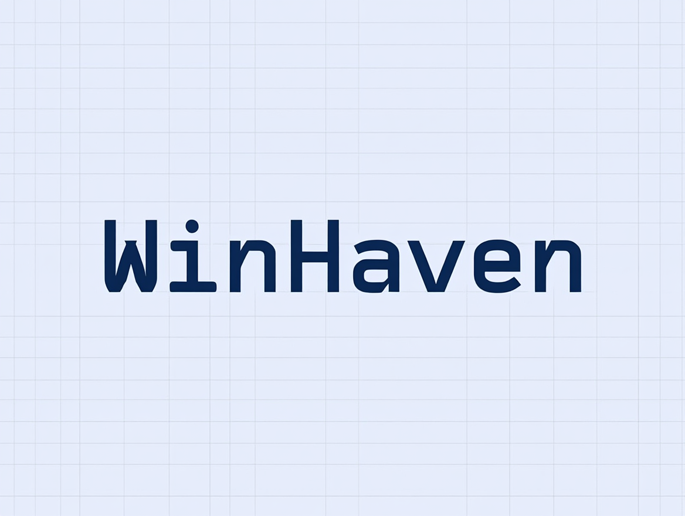

# WinHaven 🖼️

A modern Windows wallpaper manager with access to the Wallhaven collection

## ✨ Features

- 🎨 Access to a vast collection of high-quality wallpapers
- 🔍 Smart search with filters
- 📱 Responsive interface
- 🌓 Modern Material Design
- 💾 Automatic wallpaper caching
- 🖼️ One-click wallpaper setting
- 🎯 Categories: Nature, Abstract, Minimal, Cities, Space, Art

## 🚀 Installation

1. Run `WinHaven_Setup.exe`
2. Follow the installation wizard
3. Launch WinHaven from your desktop or Start menu

## 💻 System Requirements

- Windows 10 or later
- 2GB RAM minimum
- 500MB free disk space
- Internet connection for downloading wallpapers

## 📝 License

This project is licensed under the MIT License - see the [LICENSE](LICENSE) file for details.

## 🙏 Acknowledgments

- Wallpapers provided by [Wallhaven](https://wallhaven.cc)
- UI elements based on Material Design
- Built with Python and CustomTkinter

## 🤝 Contributing

Contributions are welcome! Please feel free to submit a Pull Request.

---

Made with ❤️ for Windows users

 